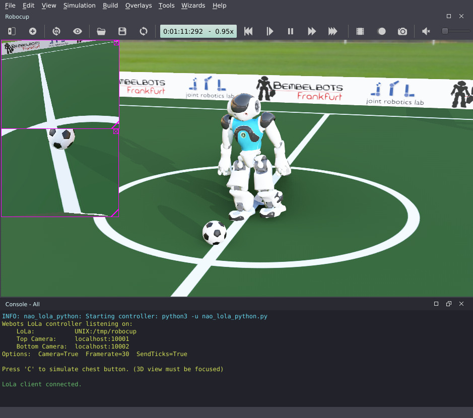

# Webots LoLa Controller

This webots controller implements the LoLa interface for Nao V6 as used by RoboCup SPL. For details on LoLa packet structure, please refer to the official LoLa documentation.

The webots controller can communicate either through a UNIX socket (default `/tmp/robocup`, like on real Nao) or TCP socket. Camera images will be served on separate TCP ports for bottom & top camera.

By default the controller will (ab)use the battery temperature field (last value in `Battery` array) as a LoLa cycle counter that is increased with each LoLa packet sent. The client can use this field to calculate simulation time (multiply by 12ms) and match camera images to corresponding LoLa packets.

## Dependencies

The controller is written in Python3 and has been tested to work with Webots 2022a & 2022b (nightly).
It depends on [OpenCV](https://pypi.org/project/opencv-python/) and [NumPy](https://numpy.org/) python modules for converting camera images to YUV422.

## ControllerArgs

The following settings can be changed by setting the `contollerArgs` field in webots:

| Option | Description |
|--------|-------------|
| --no-camera | Disable Webots cameras and image server |
| --tcp | Listen on TCP instead of UNIX socket for LoLa communication |
| --listen=`ADDR` | Path for LoLa UNIX socket or address on which TCP server will listen on              (`<host>:<port>` or `<port>`) |
| --tcam-listen=`ADDR` | Listen address for top camera image server (`<host>:<port>` or `<port>`) |
| --bcam-listen=`ADDR` | Listen address for bottom camera image server (`<host>:<port>` or                   `<port>`) |
| --framerate=`FPS` | simulated camera framerate (default: 30) |
| --no-ticks | Do not increase the battery temperature with with each simulations step |

## Camera Images

If camera images are enabled, the webots controller will spawn two TCP servers, one for each camera. Webots images are converted to YUV422 format (compatible with v4l2 image format on real robot) and preceeded by a 16 byte header.
Camera images will always be generated during a LoLa cycle, which has a cycle time of 12ms. If the frame interval is not evenly divisible by 12ms this will cause some jitter, though the set framerate will be maintained on average.

| Field  | Date type | Size (bytes) | Description |
|--------|-----------|--------------|-------------|
| magic  | char      | 8 | magic value to identify start of image data (always `wbimage\0`) |
| tick   | uint16    | 2 | counter that increases with each LoLa cycle, can be used to correlate images to LoLa packets |
| camId  | uint8     | 1 | camera ID (0 for top camera, 1 for bottom camera) |
| bpp    | uint8     | 1 | bytes per pixel (currently always 2, since webots images are converted to YUV422) |
| width  | uint16    | 2 | image width in pixels |
| height | uint16    | 2 | image height in pixels |
| data   | char      | bbp\*width\*height | raw YUV422 image data |

## Worlds & Protos

Included in this repo are updated Nao proto files (joint limits updated according to Nao V6 documentation), an updated soccer field according to current SPL Rules and two demo worlds.

The `nao_robocup.wbt` world contains a single Nao on a SPL 2020 field which will listen on UNIX socket `/tmp/robocup`.

`full_game.wbt` simulates a full game with two teams of five Naos each. This world is provided to demonstrate the usage of `controllerArgs` and TCP sockets for LoLa packets (do not expect this to run at realtime speeds).

The soccer field contains only a dummy texture with the correct lines on a plain green background. A PNG file with just the lines on transparent backgound is provided in `protos/textures/spl2020_lines.png`, in case you would like to create a more realistic texture.

